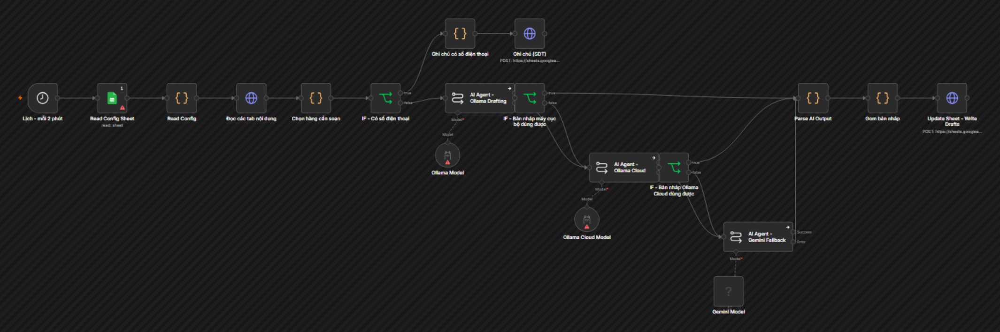
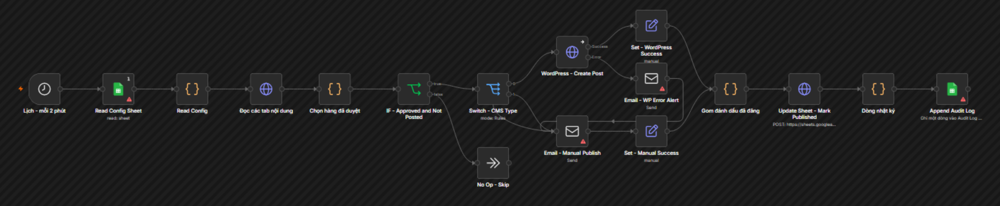
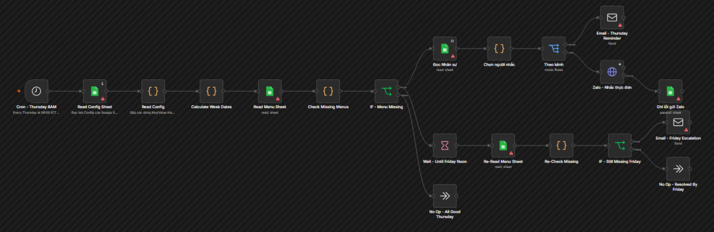
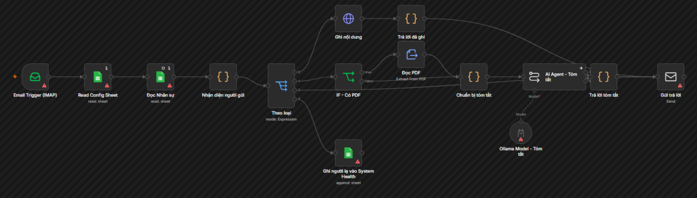
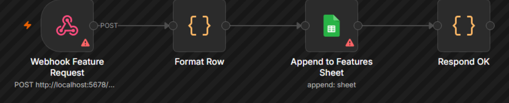
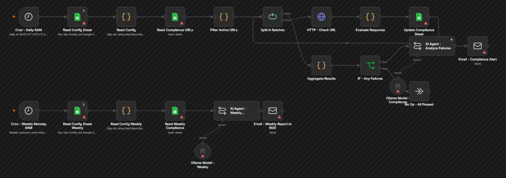
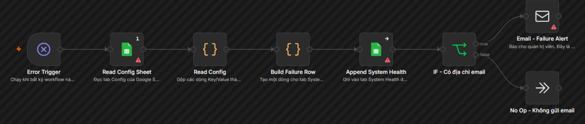
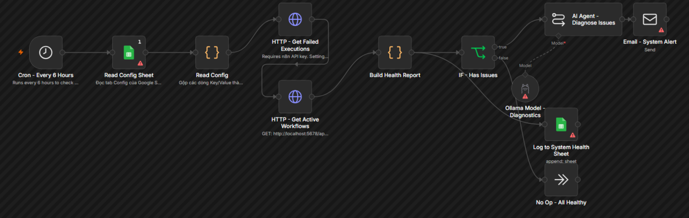
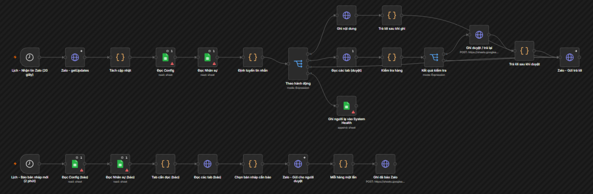
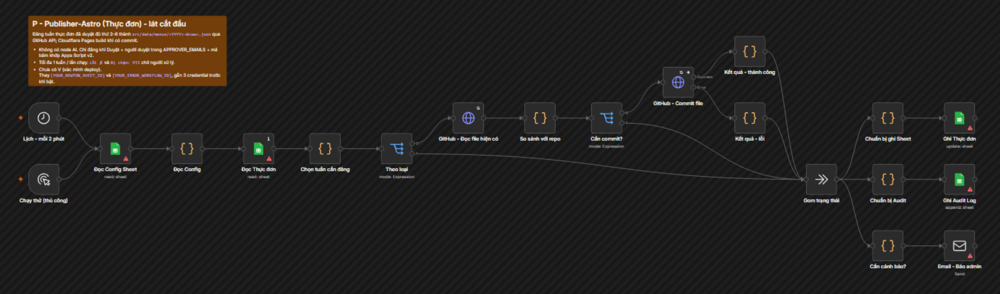

# n8n-school-ops

Self-hosted n8n automation for a school's website operations, plus the school website it manages.
Staff enter content once in a Google Sheet. n8n drafts it with a local LLM, waits for a human
approval, publishes it, and records the result.

> Status: pilot. Workflows ship inactive and are being tested and activated one at a time.

## How it works

```
 Staff (Google Sheet or Zalo)
          |
          v
 +------------------+     +---------------------------------------+
 |   Google Sheet   |<--->| C  Drafting agent                     |
 |  (single source  |     |    local LLM (Ollama) -> 3 drafts:    |
 |   of truth)      |     |    website / Zalo / Facebook          |
 |                  |     |    Gemini free tier as fallback       |
 |  Content         |     +---------------------------------------+
 |  Drafts          |
 |  Approval  <-----+---- Human ticks "Approved"; Apps Script stamps who + when
 |  Published       |
 |                  |     +---------------------------------------+
 |                  |<--->| D  Publisher: approved rows only ->   |
 |                  |     |    CMS API, or email to manual poster |
 +------------------+     +---------------------------------------+
          ^
          |   E  Reminder       missing content before the deadline
          |   G  Compliance     required public pages live + correct
          +-- H  Global error   any failure -> alert a person
              Master            health check every 6 hours
```

No workflow calls another or keeps its own state. Everything moves through the Sheet, so the
whole pipeline is readable in one place, and work can continue by hand if automation stops.

## What's in this repo

| Path | Contents |
|---|---|
| `workflows/` | n8n workflow exports (Vietnamese). `workflows/en/` is the English mirror; `workflows/newton/` holds the kindergarten site's publisher |
| `scripts/` | Google Apps Script (approval stamp) and the n8n backup script. `scripts/en/` mirrors it; `scripts/newton/` has the kindergarten approval stamp |
| `dashboard/` | Static status dashboard + small proxy. `dashboard/en/` mirrors it |
| `infra/` | Docker Compose for n8n + Postgres (n8n image pinned in `Dockerfile`), and `.env.example`. Ollama runs natively on the host |
| `website/` | Git submodule: the kindergarten website (Astro) |

### Workflows

| File | Purpose |
|---|---|
| `workflow-c-drafting-agent` | Drafts website / Zalo / Facebook versions for every content tab (menu, notices, schedule, news), with the campus name from Config (local model, hosted fallback) |
| `workflow-d-auto-publish` | Publishes rows a human approved, from every content tab; records the result |
| `workflow-e-thursday-reminder` | Reminds each responsible staff member (email or Zalo, from the staff tab) about missing menus |
| `workflow-i-email-intake` | Staff email intake: files content into the right tab, or replies with a summary of an attached PDF. Unknown senders get no reply |
| `workflow-f-feature-tracker` | Tracks feature / task status |
| `workflow-g-compliance-monitor` | Checks that required public pages are live and contain the right content |
| `workflow-h-global-error` | Catches failures from other workflows and alerts a person |
| `workflow-master-orchestrator` | Health check: failed runs and workflows that should be active |
| `workflow-z-zalo-gateway` | Staff-only Zalo bot (trial): submit content, approve or return drafts, get notified of new drafts |
| `newton/nwt-p-publisher-astro` | Publishes approved news to the Astro kindergarten site; re-checks the approval hash so content edited after approval is held back |

### Workflow canvases

As they appear in the n8n editor (click a name to expand). Red markers only mean no credentials are attached in the export.



<details><summary>D · Auto-publish</summary>



</details>
<details><summary>E · Thursday reminder</summary>



</details>
<details><summary>I · Email intake</summary>



</details>
<details><summary>F · Feature tracker</summary>



</details>
<details><summary>G · Compliance monitor</summary>



</details>
<details><summary>H · Global error</summary>



</details>
<details><summary>Master · Health check</summary>



</details>
<details><summary>Z · Zalo staff gateway</summary>



</details>
<details><summary>P · Newton publisher (Astro)</summary>



</details>

## Design rules

- Nothing is published without a human approval.
- No automatic replies to parents; no automatic posting to Zalo or Facebook.
- No student personal data is processed.
- Every failure alerts a person or is visible in the Sheet.
- Staff don't learn new software: Google Sheets (and Zalo) only.

## Built with

- **n8n** (self-hosted, Community edition) on **Docker Compose** with **Postgres**
- **Ollama** running `qwen2.5:7b` locally (fits an 8 GB laptop GPU); **Gemini** free tier as fallback
- **Google Sheets** as the data layer, **Google Apps Script** for approver identity, the school's SMTP server for alerts
- **Astro** static site for the school website, with verification scripts for SEO, routes,
  colour contrast, and EXIF stripping
- Developed with a team of AI coding agents (OpenCode CLI via a local model router, local models
  first and cloud models as fallback, GitHub Copilot CLI as reviewer)

Running cost is close to zero: local models plus free tiers.

## Quick start

```bash
git clone --recurse-submodules https://github.com/DD134345/n8n-school-ops.git
cd n8n-school-ops/infra
cp .env.example .env        # WIN_HOST_IP, VM_IP, passwords; never commit .env
docker compose up -d        # n8n on http://<VM_IP>:5678
```

1. **Ollama** is not in the Compose stack: run it on the host (`ollama pull qwen2.5:7b`) with
   `OLLAMA_HOST=0.0.0.0:11434`, and allow TCP 11434 in the firewall from the VM subnet only. n8n
   reaches it at `http://winhost:11434`.
2. **Credentials**: create them in n8n from a browser where `localhost:5678` reaches n8n (the VM's
   own browser, or a port-forward). Google refuses plain-http OAuth redirects to private IPs.
3. **Build per-campus workflows**: copy `infra/campuses.example.json` to `infra/campuses.json`, fill in
   each campus's Sheet ID and the credential IDs, then run `node scripts/build-workflows.mjs`. It writes
   `infra/import/<CODE>/` with every placeholder filled, names prefixed `[CODE]`, and prints the
   `EXPECTED_WORKFLOWS` value for that campus's Config tab. It stops if anything is left unfilled.
4. **Import**: `docker compose exec n8n n8n import:workflow --separate --input=/import/<CODE>`.
5. **Zalo**: one bot per campus; put `ZALO_BOT_TOKEN_<CODE>=...` in `infra/zalo.env`.

All workflows ship inactive. Fill each campus Sheet's `Config` and `Nhân sự` tabs first
(`docs/SETUP.md`). `workflows/` (Vietnamese) is canonical; `workflows/en/` only mirrors the
core fixes.

Website:

```bash
cd website && npm install && npm run dev
```

## Not in this repo

Project documents, proposals, internal notes and agent/tooling configuration are kept private.
Secrets are never committed. If you find one, please open an issue without quoting it.

## Contact

Questions or want to compare notes on n8n, local LLMs or human-in-the-loop automation?
Open an issue or reach out via my GitHub profile.
